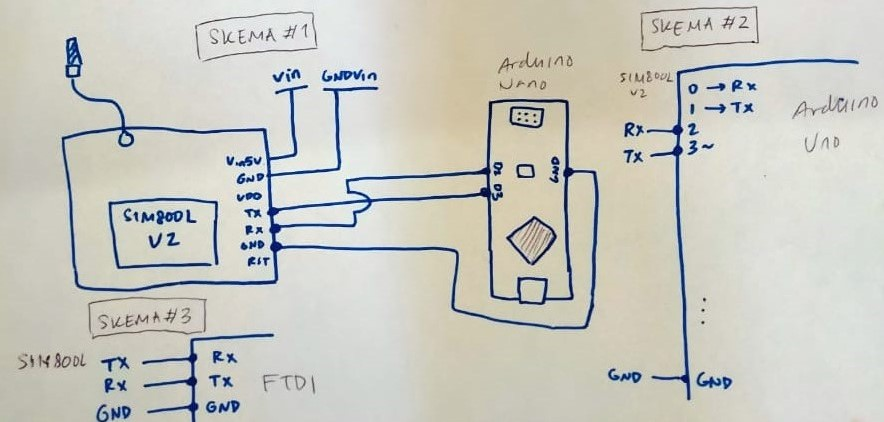
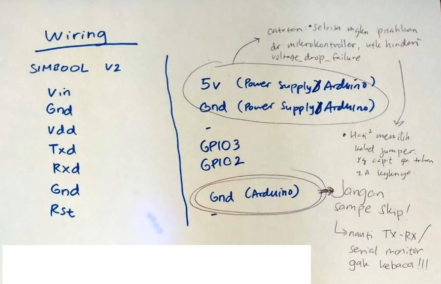

# Adafruit MQTT :cloud:

This project can be used to do MQTT actions via GPRS with the SIM800L V2 module (not the SIM800L V1, nor any other type of module guaranteed to succeed).

## How To:
### Preparation:

- Install [Arduino IDE](https://www.arduino.cc/en/main/software), or any IDE that can compile with the Arduino Framework

### Wiring/Cabling SIM800L V2 (Follow the schematic):
- Connect SIM800 GND PIN with power source 
> if possible, differ power source with microcontroller. If use microcontroller as power source, e.g: arduino; sometimes cause failure, or voltage drop. Causing SIM800 module to restart endlessly.
- Connect SIM800 TX PIN with GPIO3 (Arduino Uno and others) or D3 (Arduino Nano) or RX PIN (FTDI/CH340)
- Connect SIM800 RX PIN with GPIO2 (Arduino Uno and others) or D2 (Arduino Nano) or TX PIN (FTDI/CH340)
- Connect SIM800 GND PIN with GND of microcontroller/USB to TTL Serial
- Connect SIM800 Vin5v with proper 5v power source 
> if possible, differ power source with microcontroller. If use microcontroller as power source, e.g: arduino; sometimes cause failure, or voltage drop. Causing SIM800 module to restart endlessly.

> Plug the 5v LAST, to not damage the SIM800 module

- Wait until LED blinks at 1s interval
- Wait until LED blinks at 3s interval
- Module SIM800 is ready to use

Below is Full Schematic



### Program it!:

1. Create **credentials.h**, save within the same folder. **credentials.h** copy this inside, and change the `AIO_USERNAME` and `AIO_KEY` as how your io.adafruit.com account is. Leave the others as is:
```cpp
#define AIO_SERVER      "io.adafruit.com"
#define AIO_SERVERPORT  1883
#define AIO_USERNAME    "yourUsernameHere"
#define AIO_KEY         "YourAIOkeyHere"
```
2. Open file "adafruit-mqtt.ino"
4. Choose proper Serial COM
4. Build, Upload

---

### a note from Royyan

a :droplet: Aquifera Project

Use this as you wish! Happy making! :octocat: